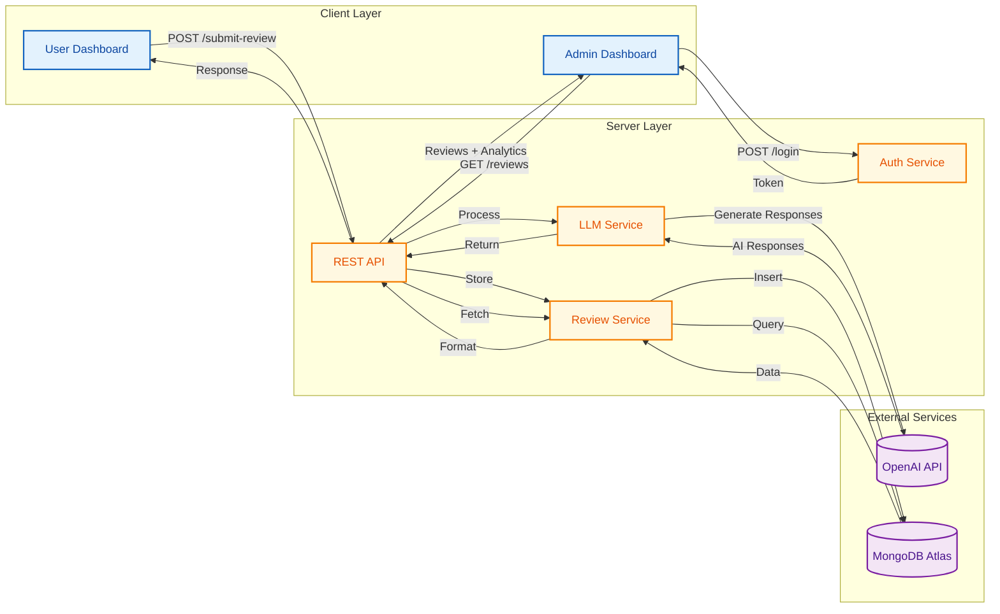
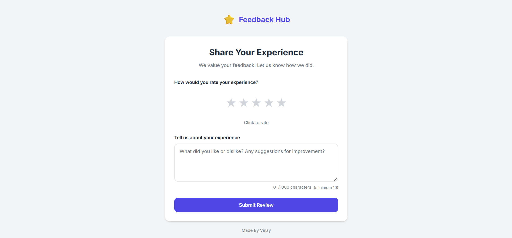
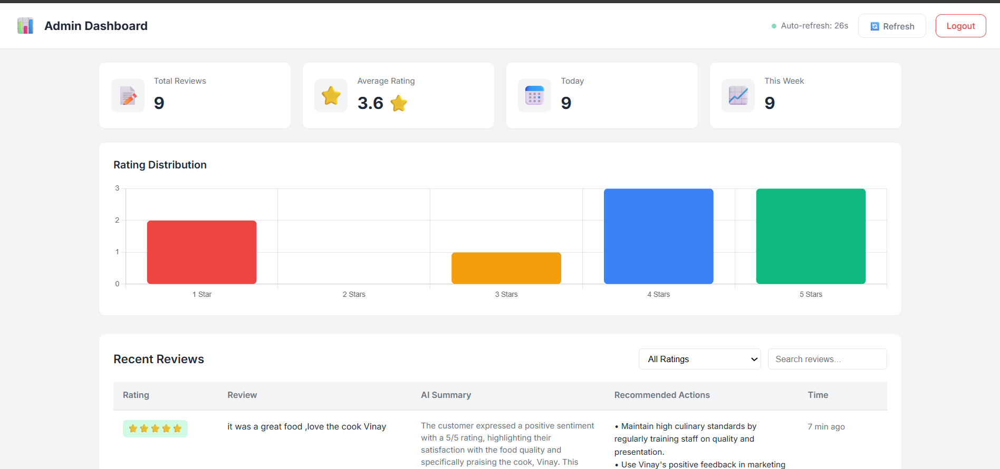
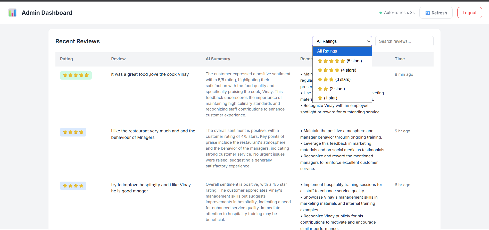
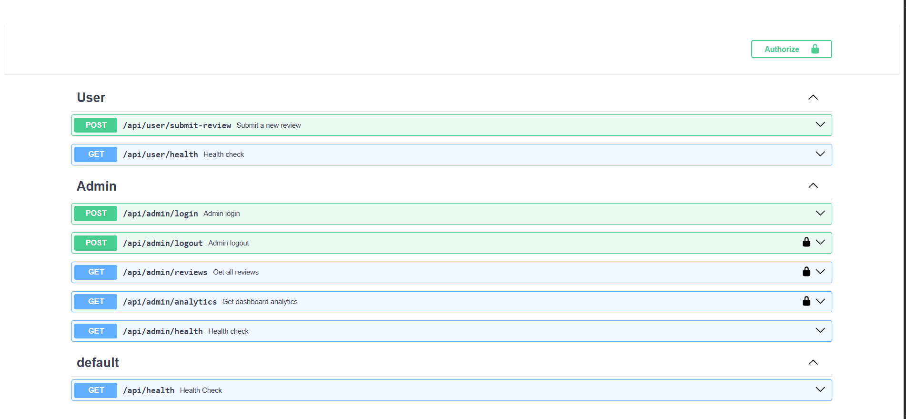

# Review Analysis System

A comprehensive AI-powered review analysis project consisting of two main tasks:
1. **Task 1**: Yelp Review Rating Prediction using LLM Prompting Techniques
2. **Task 2**: Two-Dashboard AI Feedback System (Web Application)

---

## Table of Contents

- [Task 1: Rating Prediction via Prompting](#task-1-rating-prediction-via-prompting)
  - [Overview](#overview)
  - [Prompting Techniques](#prompting-techniques)
  - [Batch Processing](#batch-processing)
  - [Results & Analysis](#results--analysis)
- [Task 2: AI Feedback System](#task-2-ai-feedback-system)
  - [Live Demo](#live-demo)
  - [System Architecture](#system-architecture)
  - [Screenshots](#screenshots)
  - [Tech Stack](#tech-stack)

---

# Task 1: Rating Prediction via Prompting

## Overview

This task involves designing prompts that classify Yelp reviews into 1-5 star ratings using **LangChain**, **GPT-4o-mini**, and **Pydantic** for structured output validation.

The goal is to compare different prompting strategies and identify which approach yields the best prediction accuracy.

## Prompting Techniques

Four distinct prompting approaches were implemented and evaluated:

### Prompt 1: Direct Classification
A straightforward prompt that directly asks the model to predict the star rating.
- **Approach**: Simple, concise instruction
- **Pros**: Fast, low token cost
- **Cons**: Limited context for nuanced reviews

### Prompt 2: Aspect-Based Analysis
Asks the model to analyze specific aspects (service, quality, value) before rating.
- **Approach**: Multi-dimensional analysis
- **Pros**: Better understanding of review components
- **Cons**: Slightly higher token usage

### Prompt 3: Few-Shot Learning
Provides example reviews with their ratings to guide the model.
- **Approach**: Learning from examples
- **Pros**: Better pattern recognition
- **Cons**: Longer prompts, schema validation issues in batch processing

### Prompt 4: Chain-of-Thought (CoT)
Guides the model through step-by-step reasoning before prediction.
- **Approach**: Explicit reasoning chain
- **Pros**: Best accuracy, most reliable
- **Cons**: Highest token usage

## Batch Processing

All prompt techniques were evaluated using batch processing on **200 Yelp reviews**:
- Used `batch()` method from LangChain for parallel processing
- Pydantic schemas ensure structured JSON output
- Original ratings stored separately (not leaked to LLM)
- Evaluation metrics calculated post-inference

## Results & Analysis

### Final Rankings

| Rank | Prompt | Exact Match | Within ±1 | MAE | Valid/Failed |
|:----:|--------|:-----------:|:---------:|:---:|:------------:|
| 1st | **Prompt 4 (CoT)** | **67.50%** | 96.50% | **0.360** | 200/0 |
| 2nd | Prompt 2 (Aspect) | 65.50% | **97.50%** | 0.370 | 200/0 |
| 3rd | Prompt 1 (Direct) | 65.00% | 97.00% | 0.380 | 200/0 |
| 4th | Prompt 3 (Few-Shot) | 63.95% | 96.51% | 0.395 | 172/28 ⚠️ |

### Accuracy by Star Rating

| Star Rating | Prompt 1 | Prompt 2 | Prompt 3 | Prompt 4 |
|:-----------:|:--------:|:--------:|:--------:|:--------:|
| 1-star | 50.00% | 55.56% | 62.50% | 50.00% |
| 2-star | 64.71% | 64.71% | 42.86% | 58.82% |
| 3-star | 51.52% | 54.55% | 51.72% | **60.61%** |
| 4-star | 63.29% | 62.03% | 66.67% | 65.82% |
| 5-star | 81.13% | 81.13% | 75.00% | **83.02%** |

### Insights

#### Most Accurate (Easy to Predict)
- **5-star reviews**: 75-83% accuracy across all prompts
- Clear positive sentiment and enthusiastic language

#### Least Accurate (Hard to Predict)
- **1-star reviews**: Only 50-62% accuracy (model shows "optimism bias")
- **3-star reviews**: Only 51-61% accuracy (most ambiguous, mixed sentiment)

#### Error Distribution
All prompts show similar error patterns:
- **64-68%** exact matches
- **29-32%** off by 1 star
- **2.5-3.5%** off by 2 stars

### Prompt 4 (Chain-of-Thought) Wins

| Metric | Result |
|--------|--------|
| Highest exact match | **67.50%** (+2% over Prompt 2) |
| Lowest MAE | **0.360** (best error minimization) |
| Best 3-star accuracy | **60.61%** (most difficult rating) |

---

# Task 2: AI Feedback System

| Dashboard | URL |
|-----------|-----|
| **User Dashboard** | [https://review-analysis-4p9j.onrender.com/user/](https://review-analysis-4p9j.onrender.com/user/) |
| **Admin Dashboard** | [https://review-analysis-4p9j.onrender.com/admin/](https://review-analysis-4p9j.onrender.com/admin/) |
| **API Documentation** | [https://review-analysis-4p9j.onrender.com/api/docs/](https://review-analysis-4p9j.onrender.com/api/docs/) |

> **Admin Password**: `admin123`

## System Architecture



## Screenshots

### User Dashboard

*Users can submit reviews with star ratings and receive instant AI-generated responses*

### Admin Authentication

*Secure password-protected admin access*

### Admin Dashboard - Overview

*Analytics cards showing total reviews, average rating, and activity metrics*

### Admin Dashboard - Reviews

*Paginated reviews table with AI summaries and recommended actions*

### FastAPI Documentation

*Interactive API documentation with Swagger UI*

## Tech Stack

| Layer | Technology |
|-------|------------|
| **Frontend** | HTML5, CSS3, Vanilla JavaScript, Chart.js |
| **Backend** | FastAPI, Python 3.11, Uvicorn |
| **Database** | MongoDB Atlas (Motor async driver) |
| **AI/LLM** | LangChain, OpenAI GPT-4o-mini |
| **Validation** | Pydantic v2 |
| **Deployment** | Render|

---

## Project Structure

```
Review/
├── README.md                
├── images/                   # Screenshots
│   ├── user.png
│   ├── admin_auth.png
│   ├── admin_dashboard1.png
│   ├── admin_dashboard2.png
│   └── fastapi.png
├── task1/                    # Rating Prediction Task
│   ├── task1.ipynb                    # Jupyter notebook with all experiments
│   ├── yelp.csv                       # Dataset (200 reviews)
│   ├── metrics_comparison.csv         # Comparison metrics across all prompts
│   ├── prompt_comparison_analysis.png # Visualization of results
│   ├── results_prompt1.csv            # Predictions from Prompt 1
│   ├── results_prompt2.csv            # Predictions from Prompt 2
│   ├── results_prompt3.csv            # Predictions from Prompt 3
│   ├── results_prompt4.csv            # Predictions from Prompt 4
│   ├── review_prompts.csv             # Merged result from all techniques
│   └── yelp_prediction.log            # Execution logs
└── task2/                    # Web Application Task
    ├── backend/
    │   ├── app/
    │   │   ├── main.py
    │   │   ├── config.py
    │   │   ├── database.py
    │   │   ├── models.py
    │   │   ├── routes/
    │   │   ├── services/
    │   │   ├── prompts/
    │   │   └── utils/
    │   └── requirements.txt
    └── frontend/
        └── public/
            ├── user/
            └── admin/
```

---

## Local Development

### Task 1
```bash
cd task1
jupyter notebook task1.ipynb
```

### Task 2
```bash
cd task2/backend
pip install -r requirements.txt
uvicorn app.main:app --reload --port 8000
```

Access locally:
- User: http://localhost:8000/user/
- Admin: http://localhost:8000/admin/
- API Docs: http://localhost:8000/api/docs/

---
